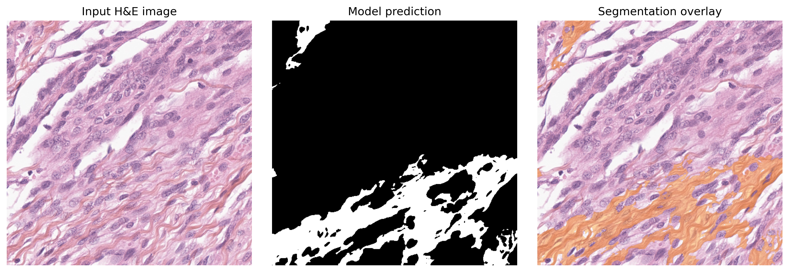

# DeepCollagenSeg
## Overview
Pytorch implementation of the paper "XX"

## 1) Clone the repository
```bash
git clone https://github.com/dmanou/DeepCollagenSeg.git
cd DeepCollagenSeg
```
### 2) Create Conda environment (Python 3.9.16)
```bash
conda create -n segcoll python=3.9.16 -y
conda activate segcoll
```
### 3) Install dependencies
```bash
pip install -r requirements.txt
```
### 4) PyTorch installation
```bash
pip install torch==2.0.1 torchvision==0.15.2 torchaudio==2.0.2 --index-url https://download.pytorch.org/whl/cu118
```
## Load and store model pretrained weights
To run the inference script, you must first download the pre-trained weights.
```bash
mkdir -p model/weights
wget https://github.com/dmanou/DeepCollagenSeg/releases/download/v1.0.0/pretrained_weights.pth -O model/weights/pretrained_weights.pth
```
## Run inference
### Tile inference
Run the model on a single tile, a folder of tiles, or a CSV listing tile paths.
```bash
python tile_inference.py --tile path/to/tile_or_folder_or_csv --save_mask
```
This writes `results/tile_inference/tile_inference_report.csv` (one row per
tile, with its predicted collagen ratio) and, with `--save_mask`, a PNG mask
per tile under `results/tile_inference/masks/`.

### Whole Slide Image
Tile a WSI (tissue detection + patch extraction) and run inference on it in
one command:
```bash
python wsi_inference.py --wsi path/to/slide.svs --preprocess
```
If the slide was already tiled by a previous run, drop `--preprocess` to
reuse the existing tiles. Results are written to
`results/wsi_inference/<slide_id>/`.

Run `python tile_inference.py -h` or `python wsi_inference.py -h` for the
full list of options (batch size, decision threshold, tile size, etc.).

## Cell counting (StarDist)
Nucleus counting on the same kind of tiles, using the pretrained
`2D_versatile_he` StarDist model (no training required):
```bash
pip install -r requirements-stardist.txt
python stardist_inference.py --tile path/to/tile_or_folder_or_csv --save_labels
```
This writes `results/stardist/stardist_report.csv` (one row per tile, with
its predicted cell count) and, with `--save_labels`, an instance label map
(`.npy`) per tile under `results/stardist/labels/`.

## Project structure
```
DeepCollagenSeg/
├── model/
│   ├── unet.py              # UNet with two auxiliary heads
│   ├── blocks.py             # Conv blocks used by the UNet
│   └── weights/              # Pretrained weights go here (see above)
├── dataloader.py              # Datasets + tile-path resolution, shared by all scripts
├── preprocessing.py           # Tissue detection & WSI tiling
├── utils.py                    # Inference helpers (device, load_model, save_mask...)
├── tile_inference.py           # python tile_inference.py --tile ... --save_mask
├── wsi_inference.py            # python wsi_inference.py --wsi ... --preprocess
├── stardist_inference.py       # python stardist_inference.py --tile ... --save_labels
├── requirements.txt
└── requirements-stardist.txt
```
